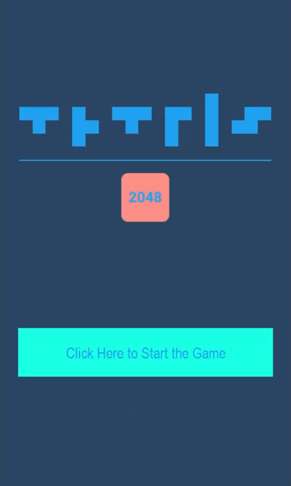

# tetris2048

tetris2048 is a game that merges the rules of Tetris and 2048 games. It is made with Python and the PyGame library.

Gameplay: [YouTube](https://www.youtube.com/watch?v=wSNcK6FOM7I)

## Screenshots

### Start

### Gameplay

